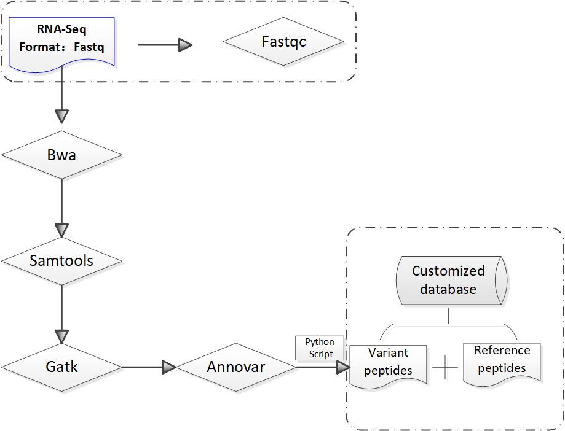
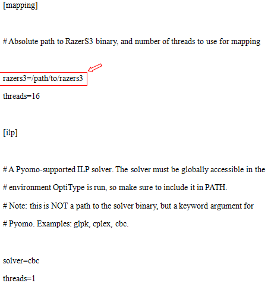
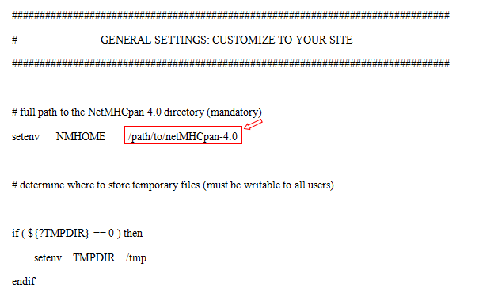
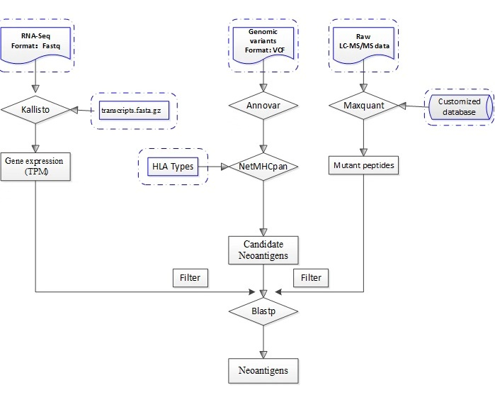

# ProGeo-neo
 a Customized Proteogenomic Workflow for Neoantigen Prediction and Selection
 
# User’s Manual
## 1.    Running environment
ProGeo-neo requires a Linux operation system (centos6) with Python (V2.7) , Perl and Java installed. 
## 2.	External reference datasets
In order to run normally, some third-party software such as BWA ,Gatk,and Annovar need extra databases. Here we provided these files in the reference_files, such as Hg38.fasta. In addition, during annotating genetic variants, annovar software needs lots of databases including: refGene, ensGene, cytoBand, avsnp147, dbnsfp30a, MT_ensGeneMrna, refGeneWithVerMrna, etc. of hg 38, putting them into humandb folder for the sake of convenience. 
## 3.	Usage
```bash
cd ProGeo-neo   
Users with root privileges can ignore the following:
chmod  755  soft/bwa/bwa
chmod  755  soft/samtools/samtools
chmod  755  soft/bcftools/bcftools
chmod  755  soft/gatk/gatk 
chmod  755  soft/annovar/convert2annovar.pl
chmod  755  soft/annovar/table_annovar.pl
chmod  755  soft/annovar/annotate_variation.pl
```

### 3.1 Construction of customized protein sequence database[1-5]
```bash
python  get_variant-fasta.py  /path/to/RNA-seq1_1.fastq  /path/to/RNA-seq1_2.fastq
```
eg: python  get_variant-fasta.py  test/rna/rnaseq-sample1_1.fastq  test/rna/rnaseq-sample1_2.fastq



Figure1. Construction of customized protein sequence database  
### Reference method: 
In order to generate the customized protein sequence database, protein sequences with missense mutation sites can be generated by substituting the mutant amino acid in normal protein sequences and all mutan sequences were appended to the normal protein and cRAP fasta file. Here we only provide mutant protein sequences (Var-proSeq.fasta) based on RNASeq data, users can add other reference protein sequences as needed.
### 3.2 Precision HLA typing from next-generation sequencing data[6] 
#### 3.2.1 Install all required software and libraries 
*   1.Include samtools, razers3, hdf5 and cbc in your PATH environment variable. Add HDF5's lib directory to your LD_LIBRARY_PATH.
*   2.Installation of samtools
```bash
cd soft/samtools
./configure --prefix= /path/to/soft/
make &&make install
```
*   3.Installation of cbc 
```bash
cd soft/Cbc-2.9.9
BuildTools/get.dependencies.sh
./configure
make  &&  make install
```
*   4.export HDF5_DIR=/path/to/hdf5-1.8.15
*   5.install packages
```bash
pip install numpy
pip install pyomo
pip install pysam
pip install matplotlib
pip install tables
pip install pandas
pip install future
```
*   6.Create a configuration file following config.ini



#### 3.2.2 Predicting HLA typing from next-generation sequencing data
```bash
cd soft/OptiType
python OptiTypePipeline.py -i /path/to/RnaSeq_1.fastq /path/to/RnaSeq_2.fastq --rna -v -o   rna-hla_output        
```
eg: python OptiTypePipeline.py -i ./test/rna/CRC_81_N_1_fished.fastq ./test/rna/ CRC_81_N_2_fished.fastq  --rna  -v -o  ./test/rna/
### 3.3  Prediction and Filtration of Neontigens[2,7-10]
#### 3.3.1 Install all required software 
*   1.Installation of NetMHCpan-4.0
```bash
cd  soft/NetMHCpan-4.0
```
In the 'netMHCpan-4.0' directory edit the script 'netMHCpan' [7]:
At the top of the file  locate the part labelled  "GENERAL SETTINGS: CUSTOMIZE TO YOUR SITE”, set the 'NMHOME' variable to the full path to the 'netMHCpan-4.0' directory on your system.


 
*   2.Installation of mono
```bash
cd  soft/mono-5.18.0.225
./configure  --prxfix=path/to/soft
make  &&  make install
```
*   3.Include netMHCpan-4.0, kallisto and blast in your PATH environment variable. 

#### 3.3.2 Prediction and Filtration of Neontigens
```bash
BLASTDB=~/soft/Balachandran/blast_db          
python  neoantigen_prediction_filtration.py  /path/to/WES.vcf  HLA_typing /path/to/transcripts.fasta.gz /path/to/RnaSeq1_1.fastq /path/to/RnaSeq1_2.fastq /path/to/raw  /path/to/.fasta 
```
#### note: ' /path/to/raw’, ‘/path/to/.fasta’ need the full path
The transcripts.fasta file supplied can be either in plaintext or gzipped format. Prebuilt indices constructed from [Ensembl reference transcriptomes](https://uswest.ensembl.org/info/data/ftp/index.html) can be download from the [kallisto transcriptome indices](https://github.com/pachterlab/kallisto-transcriptome-indices/releases) site [9].

eg: python  NetMHCpan_Maxquant_lable-free.py  test/WGS_20180423.vcf  HLA-A03:01 soft/kallisto/test/transcripts.fasta.gz  test/rna/rnaseq-sample1_1.fastq test/rna/rnaseq-sample1_2.fastq   /export3/home/user/pipline/test/ms  /export3/home/user/pipline/refseq+varseq.fasta



Figure2. Prediction and Filtration of Neontigens 


Table 1 summarizes the needed software and download links

<table>
    <thead>
    <th >Software</th>
    <th>Download address</th>
    </thead>
    <tr>
    <td>BWA-0.7.17[1] </td>
    <td>[http://bio-bwa.sourceforge.net/](http://bio-bwa.sourceforge.net/)</td>
    </tr>
    <tr>
    <td>Samtools-1.9[2]</td>
    <td>[https://github.com/samtools](https://github.com/samtools)</td>
    </tr>
    <tr>
    <td>Bcftools[3]</td>
    <td>[https://github.com/samtools/bcftools](https://github.com/samtools/bcftools)</td>
    </tr>
    <tr>
    <td>GATK4.0.10.1[4]</td>
    <td>[https://software.broadinstitute.org/gatk/download/](https://software.broadinstitute.org/gatk/download/)</td>
    </tr>
    <tr>
    <td>Annovar[5]</td>
    <td>[http://annovar.openbioinformatics.org/en/latest/user-guide/download/](http://annovar.openbioinformatics.org/en/latest/user-guide/download/)</td>
    </tr>
    <tr>
    <td>Optitype [6]</td>
    <td>[https://github.com/FRED-2/OptiType](https://github.com/FRED-2/OptiType)</td>
    </tr>
    <tr>
    <td>NetMHCpan-4.0[7]</td>
    <td>[http://www.cbs.dtu.dk/services/NetMHCpan/](http://www.cbs.dtu.dk/services/NetMHCpan/)</td>
    </tr>
    <tr>
    <td>Maxquant [8]</td>
    <td>[http://www.coxdocs.org/doku.php?id=maxquant:start](http://www.coxdocs.org/doku.php?id=maxquant:start)</td>
    </tr>
    <tr>
    <td>Kallisto [9] </td>
    <td>[https://github.com/pachterlab/kallisto](https://github.com/pachterlab/kallisto)</td>
    </tr>
    <tr>
    <td>Blast [10] </td>
    <td>[https://blast.ncbi.nlm.nih.gov/Blast.cgi](https://blast.ncbi.nlm.nih.gov/Blast.cgi)</td>
    </tr>
</table>
	
#### Reference:
[1] Li H, Durbin R. Fast and accurate short read alignment with Burrows–Wheeler transform[M]. 2009.

[2] Li H , Handsaker B, Wysoker A , et al. The Sequence Alignment/Map format and SAMtools[J]. Bioinformatics, 2009, 25(16):2078-2079.

[3] Li H. A statistical framework for SNP calling, mutation discovery, association mapping and population genetical parameter estimation from sequencing data. Bioinformatics. 2011;27(21):2987–93.

[4] Ga V D A , Carneiro M , Hartl C, et al. From FastQ data to high confidence variant calls: the Genome Analysis Toolkit best practices pipeline.[J]. Current Protocols in Bioinformatics, 2013, 43(1110):11.10.1.

[5] Wang K , Li M , Hakonarson H . ANNOVAR: functional annotation of genetic variants from high-throughput sequencing data[J]. Nucleic Acids Research, 2010, 38(16):e164-e164.

[6] Szolek A , Schubert B , Mohr C , et al. OptiType: precision HLA typing from next-generation sequencing data[J]. Bioinformatics, 2014, 30(23):3310-3316.

[7] Jurtz V, Paul S, Andreatta M, et al. NetMHCpan-4.0: Improved Peptide-MHC Class I Interaction Predictions Integrating Eluted Ligand and Peptide Binding Affinity Data[J]. Journal of Immunology, 2017, 199(9):3360.

[8] Cox J, Mann M. MaxQuant enables high peptide identification rates, individualized p.p.b.-range mass accuracies and proteome-wide protein quantification[J]. Nature Biotechnology, 2008, 26(12):1367.

[9] Bray N L, Pimentel H, Melsted, Páll, et al. Near-optimal probabilistic RNA-seq quantification.[J]. Nature Biotechnology, 2016, 34(5):525.

[10] Lobo. Basic Local Alignment Search Tool (BLAST)[J]. Journal of Molecular Biology, 2012, 215(3):403-410.


